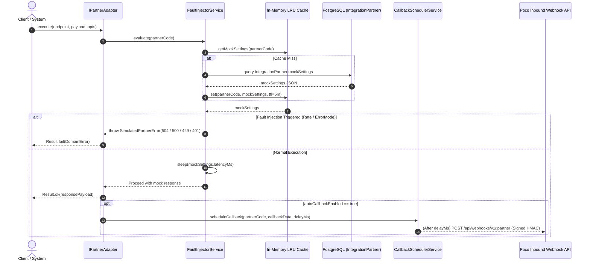
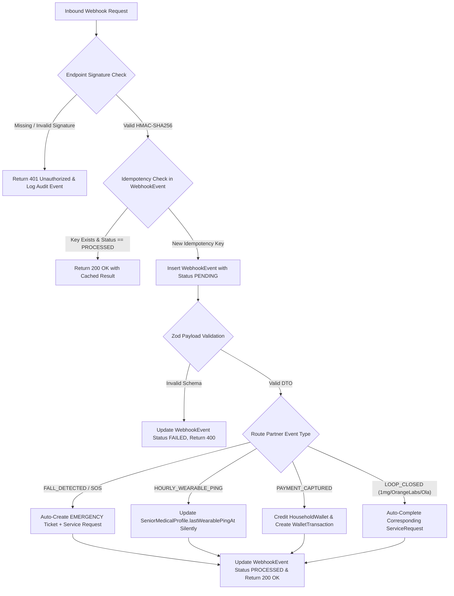

# Phase 02: Integration Partner Stubs & Interactive Mocks - Research

**Researched:** 2026-08-31
**Domain:** External Integration Partner Stubs, Interactive Frontend Simulators (Razorpay, Exotel), Signed Webhook Ingestion, IoT Wearables & Admin Integration Testbench
**Confidence:** HIGH

<user_constraints>
## User Constraints (from CONTEXT.md)

### Locked Decisions

#### 1. Backend Stub Architecture & Partner Simulation Fidelity
- **D-01:** In-process NestJS mock adapters + dedicated mock HTTP endpoints (`packages/integrations`) implementing a common `IPartnerAdapter` interface, supporting both direct TypeScript service injection and HTTP mock server routes for end-to-end webhook/callback testing. — **Reversibility:** costly — changing adapter architecture touches API controllers and mock endpoints across 12 partners.
- **D-02:** Database-driven dynamic mock settings (`IntegrationPartner.mockSettings` JSON in PostgreSQL with in-process memory caching) configuring simulated latency (100-500ms), failure rates (0-100%), error modes (timeout, HTTP 500, invalid signature, rate limit), and response templates.
- **D-03:** Strongly-typed Zod schemas per partner in `@poco/validation/partners/*` providing exact request, response, and webhook DTOs with realistic fixture generators matching real-world API formats (Razorpay Order/Payment, Exotel Passthru/Call, ABHA M1/M2/M3, 1mg Order, Orange Labs Phlebotomy, Swiggy/Instamart Delivery). — **Reversibility:** costly — exported partner DTOs form the contract between stubs, webhooks, and UI testbenches.
- **D-04:** Configurable auto-callback timers with instant manual trigger: stubs schedule automatic webhook callbacks after a short delay (e.g. 5-30s in demo mode) and expose an instant `/api/test/integrations/:partner/callback` endpoint/button for automated tests and manual drills.
- **D-05:** Multi-stage emergency progression for Pococare stub simulating realistic lifecycle stages (`AMBULANCE_DISPATCHED` -> `PARAMEDIC_ASSIGNED` -> `ARRIVED_AT_SCENE` -> `HOSPITAL_ADMITTED`) with realistic ETA countdowns and driver/paramedic metadata.
- **D-06:** Complete ABDM milestone simulation (M1/M2/M3) in ABHA stub supporting ABHA ID creation/verification with mock OTP, patient consent request creation & auto-approval, and structured FHIR diagnostic/prescription record payloads.
- **D-07:** WhatsApp Business Cloud API template engine validating template parameters (family escalation alert, payment reminder, visit report), generating message IDs, tracking delivery receipts (`SENT`, `DELIVERED`, `READ`), and supporting simulated inbound family chat replies.
- **D-08:** Full outbound call logging in `OutboundIntegrationCall` model (`partnerCode`, `endpoint`, `requestPayload`, `responseStatus`, `durationMs`, correlation IDs `householdId`/`ticketId`/`serviceRequestId`) for ops auditability and health tracking.

#### 2. Interactive Frontend Simulators (Razorpay & Exotel)
- **D-09:** High-fidelity multi-method Razorpay checkout modal simulating UPI (QR + App intent), Cards with 3DS/OTP verification step, Netbanking bank picker, simulated bank downtime/card decline errors, and instant wallet balance refresh.
- **D-10:** Interactive Exotel softphone & IVR flow simulator with floating incoming caller ID pop-up, senior/household auto-lookup, IVR menu routing ("Press 1 for Emergency, 2 for Care Officer, 3 for Routine Request"), live call timer, call transfer to Ops Executive, and audio recording player.
- **D-11:** Shared UI package placement (`@poco/ui/simulators/*` exporting `RazorpayCheckoutModal` and `ExotelTelephonySimulator`) with theme-aware styling reused across Family Portal (wallet top-up) and Admin Portal (dev tools & ops call handler).
- **D-12:** End-to-end webhook pipeline execution: simulators trigger real signed HMAC webhook requests (`/api/webhooks/v1/razorpay/*` and `/api/webhooks/v1/exotel/*`) to the backend API, verifying real signature validation, DB webhook event logging, and ticket/wallet ledger updates.
- **D-13:** Standard checkout UI fidelity without in-modal dev buttons; test scenarios (decline, timeout, invalid signature) are triggered cleanly from Admin Dev Tools / test harness to preserve realistic user experience in consumer surfaces.
- **D-14:** Web Audio API DTMF tones and synthesized voice prompts ("Welcome to Poco Care...") on IVR dialpad press with visual interactive transcript.
- **D-15:** Global floating softphone widget & banner alert in Admin Portal navigation bar displaying ringing animation, ringtone, caller/household summary, and expanding into active call workspace upon answering.
- **D-16:** Responsive modal-to-bottom-sheet transition using `@poco/ui` responsive dialog primitive (centered dialog on desktop `>=768px`, draggable slide-up bottom sheet on mobile `<768px`).

#### 3. Webhook Ingestion & IoT Fall Alert Processing
- **D-17:** Transactional webhook ingestion pipeline (`/api/webhooks/v1/*`) verifying HMAC-SHA256 signature via `@poco/business-rules`, validating payload via Zod, enforcing idempotency key uniqueness in `WebhookEvent`, and tracking status (`PENDING` -> `PROCESSED` | `FAILED`).
- **D-18:** Immediate Emergency Ticket auto-creation on `FALL_DETECTED` or `SOS_BUTTON_PRESSED` IoT alerts (`raisedByType: 'webhook'`, `priority: EMERGENCY`, spawns initial `EMERGENCY_AMBULANCE` service request, and writes emergency event to household activity feed).
- **D-19:** Silent device heartbeat for hourly healthy wearable pings updating `SeniorMedicalProfile.lastWearablePingAt` without activity feed spam; periodic scanner checks devices missing pings > 75 minutes and auto-creates a `MISSED_WEARABLE_PING` routine ticket.
- **D-20:** Idempotent 200 OK with cached result on duplicate webhook deliveries sharing the same `idempotencyKey` without re-executing side-effects, preventing duplicate tickets or ledger double-entries.

#### 4. Partner Test Harness & Mock Configuration UI
- **D-21:** Comprehensive Integration Health & Config Dashboard (`/admin/integrations`) with partner grid cards showing live status badge (`ACTIVE`, `MOCK_ONLY`, `DEGRADED`, `DOWN`), last ping time, error counters, inline JSON editor for `mockSettings`, and 1-click test ping trigger.
- **D-22:** Pre-populated scenario presets + custom JSON editor in test payload builder (e.g. "Pococare: Dispatch Ambulance", "1mg: Medicine Out for Delivery", "Orange Labs: Lipid Profile Ready", "Wearable: Fall Alert with High Heart Rate") with interactive form and raw JSON mode.
- **D-23:** Visual fault injection controls in Admin UI with interactive latency slider (0ms - 3000ms), failure rate slider (0% - 100%), and error mode dropdown (`NONE`, `TIMEOUT_GATEWAY`, `HTTP_500_SERVER_ERROR`, `INVALID_HMAC_SIGNATURE`, `RATE_LIMIT_429`) updating `mockSettings` in real time.
- **D-24:** Dedicated Vitest test harness (`packages/integrations/src/__tests__/*`) covering all 12 partner stubs, fault injection scenarios, webhook idempotency, and automated callback loops with 100% test coverage.

</user_constraints>

<phase_requirements>
## Phase Requirements

| ID | Requirement Description | Verification & Target Deliverables |
|:---|:---|:---|
| **INTG-01** | Backend provides realistic stubs for Pococare, Razorpay, ABHA, Exotel, WhatsApp, 1mg, Orange Labs, Health Services, Instamart, Swiggy, Urban Company, and Ola. | `packages/integrations` package with 12 typed adapter classes implementing `IPartnerAdapter`, mock response generators, auto-callback scheduler, fault injector, and NestJS controllers/providers. |
| **INTG-02** | System provides interactive frontend modal mocks for Razorpay payment checkout and Exotel telephony IVR. | `@poco/ui/simulators/razorpay-checkout-modal.tsx` (UPI QR/intent, Cards 3DS, Netbanking) and `@poco/ui/simulators/exotel-telephony-simulator.tsx` (Web Audio DTMF, speech synthesis, floating softphone widget, call workspace). |
| **INTG-03** | Hourly healthy wearable ping webhooks are ingested silently; missed pings automatically generate an alert ticket for operations. | `POST /api/webhooks/v1/wearable/ping` updates `SeniorMedicalProfile.lastWearablePingAt`; background scanner identifies `lastWearablePingAt > 75m` and creates `ROUTINE` ticket with `MISSED_WEARABLE_PING` category. |
| **INTG-04** | Real-time wearable fall alert webhooks immediately auto-create an emergency ticket and trigger ops alerting. | `POST /api/webhooks/v1/wearable/fall-alert` validates HMAC signature, parses `FALL_DETECTED` / `SOS_BUTTON_PRESSED`, creates `EMERGENCY` ticket + `EMERGENCY_AMBULANCE` service request, and writes urgent activity feed item. |
| **INTG-05** | Admin Portal integration management interface displays stub health, allows JSON stub config editing, and supports sending test payloads. | `/admin/integrations` dashboard view with partner status cards, latency/error sliders, mock settings JSON editor, scenario preset runner, and manual webhook callback trigger. |

</phase_requirements>

---

## 1. Summary

Phase 02 builds the complete integration partner ecosystem for Poco Elder Care. In accordance with design brief constraints (§3.14, §5.6), all 12 external third-party partner integrations and IoT wearable devices run as **in-process high-fidelity stubs and interactive frontend simulators** on the NestJS backend and Next.js frontends, completely eliminating runtime dependencies on external third-party APIs while maintaining 100% production-ready interface fidelity, exact DTO contracts, HMAC-SHA256 signature verification, and full lifecycle simulation.

The architecture comprises five core pillars:
1. **Shared Integration Package (`packages/integrations`)**: In-process NestJS module with 12 modular partner adapters implementing the `IPartnerAdapter` contract, complete with dynamic fault injection (latency, failure rates, HTTP error simulation), realistic mock payload factories, and automated webhook callback progression.
2. **Comprehensive Zod Partner Contracts (`@poco/validation/partners/*`)**: Strongly-typed schemas for request, response, and webhook DTOs across all 12 partners plus Wearable IoT devices.
3. **Interactive Frontend Simulators (`@poco/ui/simulators/*`)**:
   - `RazorpayCheckoutModal`: Realistic consumer checkout modal supporting UPI QR/app intent, Card payment with simulated 3D Secure / OTP SMS verification, Netbanking bank selector, and instant wallet balance synchronization.
   - `ExotelTelephonySimulator`: Full-featured cloud telephony softphone with Web Audio API DTMF dial tones (dual-frequency sinusoidal oscillators), browser speech synthesis for IVR prompts, floating nav bar call widget, caller ID senior lookup, live call duration timer, and call recording playback.
4. **Signed Webhook Ingestion & Incident Engine (`/api/webhooks/v1/*`)**: Inbound webhook processing with timing-safe HMAC-SHA256 signature verification, idempotency tracking in `WebhookEvent`, automated ticket/service-request generation for emergency fall alerts, silent hourly heartbeat tracking, background scanner for missed pings (>75 mins), and automated loop-closed callbacks.
5. **Admin Integration Control Center (`/admin/integrations` & Dev Tools)**: Live health cards, visual fault injection sliders (0-3000ms latency, 0-100% error rate), mock settings JSON editor, scenario presets (e.g. "Pococare: Multi-stage Ambulance Dispatch", "1mg: Delivery Out", "Orange Labs: Report Ready"), and raw payload dispatcher.

---

## 2. Architectural Responsibility Map

```
┌──────────────────────────────────────────────────────────────────────────────────────────────────┐
│                                     MONOREPO REPOSITORY MAP                                      │
├──────────────────────────────────────────────────────────────────────────────────────────────────┤
│                                                                                                  │
│  packages/validation/src/partners/                 packages/integrations/src/                    │
│  ├── types.ts                                     ├── index.ts                                   │
│  ├── pococare.schema.ts                           ├── interfaces/partner-adapter.interface.ts    │
│  ├── razorpay.schema.ts                           ├── core/fault-injector.service.ts             │
│  ├── abha.schema.ts                               ├── core/callback-scheduler.service.ts         │
│  ├── exotel.schema.ts                             ├── core/webhook-dispatcher.service.ts         │
│  ├── whatsapp.schema.ts                           ├── adapters/                                  │
│  ├── one-mg.schema.ts                             │   ├── pococare.adapter.ts                    │
│  ├── orange-labs.schema.ts                        │   ├── razorpay.adapter.ts                    │
│  ├── health-services.schema.ts                    │   ├── abha.adapter.ts                        │
│  ├── instamart.schema.ts                          │   ├── exotel.adapter.ts                      │
│  ├── swiggy.schema.ts                             │   ├── whatsapp.adapter.ts                    │
│  ├── urban-company.schema.ts                      │   ├── one-mg.adapter.ts                      │
│  ├── ola.schema.ts                                │   ├── orange-labs.adapter.ts                 │
│  └── wearable-iot.schema.ts                       │   ├── health-services.adapter.ts             │
│                                                   │   ├── instamart.adapter.ts                   │
│  packages/ui/src/simulators/                      │   ├── swiggy.adapter.ts                      │
│  ├── index.ts                                     │   ├── urban-company.adapter.ts               │
│  ├── razorpay/                                    │   ├── ola.adapter.ts                         │
│  │   ├── razorpay-checkout-modal.tsx              │   └── wearable-iot.adapter.ts                │
│  │   ├── upi-payment-tab.tsx                      ├── controllers/                               │
│  │   ├── card-payment-tab.tsx                     │   ├── mock-partner.controller.ts             │
│  │   └── netbanking-tab.tsx                       │   └── test-harness.controller.ts             │
│  └── exotel/                                      └── __tests__/                                 │
│      ├── exotel-telephony-simulator.tsx               ├── adapters.spec.ts                       │
│      ├── dtmf-tone-generator.ts                       ├── fault-injection.spec.ts                │
│      ├── ivr-speech-synthesizer.ts                    ├── webhook-ingestion.spec.ts              │
│      ├── softphone-floating-widget.tsx                └── wearable-monitoring.spec.ts            │
│      └── call-workspace.tsx                                                                      │
│                                                                                                  │
│  apps/api/src/modules/                            apps/admin-portal/src/app/admin/integrations/  │
│  ├── webhooks/                                    ├── page.tsx (Health dashboard & grid cards)   │
│  │   ├── webhooks.controller.ts                  ├── components/partner-health-card.tsx         │
│  │   ├── webhooks.service.ts                     ├── components/fault-injection-drawer.tsx      │
│  │   └── handlers/                               ├── components/scenario-preset-runner.tsx      │
│  │       ├── wearable-webhook.handler.ts          └── components/raw-payload-dispatcher.tsx      │
│  │       ├── razorpay-webhook.handler.ts                                                         │
│  │       ├── exotel-webhook.handler.ts                                                           │
│  │       └── loop-closed-webhook.handler.ts                                                      │
│  └── jobs/wearable-ping-scanner.job.ts                                                           │
└──────────────────────────────────────────────────────────────────────────────────────────────────┘
```

---

## 3. 12-Partner & Wearable Backend Mock Architecture (`packages/integrations`)

### 3.1 `IPartnerAdapter` Interface Pattern
All partner stubs implement a uniform TypeScript interface that standardizes execution, outbound call logging, fault injection evaluation, and asynchronous callback scheduling:

```typescript
export interface PartnerExecutionOptions {
  householdId?: string;
  ticketId?: string;
  serviceRequestId?: string;
  bypassFaultInjection?: boolean;
}

export interface IPartnerAdapter<TRequest = any, TResponse = any> {
  readonly partnerCode: PartnerCode;
  readonly defaultEndpoint: string;

  /**
   * Execute partner API action with automatic fault injection,
   * latency delay, outbound logging, and optional callback scheduling.
   */
  execute(
    endpoint: string,
    payload: TRequest,
    options?: PartnerExecutionOptions
  ): Promise<Result<TResponse, PartnerExecutionError>>;

  /**
   * Trigger immediate or delayed signed webhook callback to Poco API.
   */
  triggerCallback(
    eventType: string,
    callbackPayload: Record<string, any>,
    delayMs?: number
  ): Promise<WebhookDispatchResult>;
}
```

### 3.2 Real-World API Shapes & Lifecycle Specifications for All 12 Partners

#### 1. Pococare (`POCOCARE`) — Emergency Ambulance Dispatch & EMR Sync
- **Domain**: 24x7 Ambulance dispatch, real-time paramedic assignment, hospital emergency department handoff, and ICE medical profile synchronization [CITED: §3.10, §4.2].
- **Request / Response**:
  - `POST /api/v1/emergency/dispatch`: `{ patientId, seniorName, coordinates: { lat, lng }, address, iceContacts, medicalConditions }` -> Returns `{ dispatchId, status: 'DISPATCHED', etaMinutes: 12, vehicleNumber: 'KA-01-EA-9911', paramedicName: 'Ramesh Kumar', paramedicPhone: '+919876543210' }`.
  - `PUT /api/v1/patients/:id/medical-profile`: Updates chronic conditions, blood group, preferred hospital.
- **Multi-Stage Progression Lifecycle**:
  1. `AMBULANCE_DISPATCHED` (T+0s, ETA: 12 mins)
  2. `PARAMEDIC_ASSIGNED` (T+5s, Paramedic vitals monitoring kit active)
  3. `ARRIVED_AT_SCENE` (T+15s, Paramedic on site, initial triage assessment)
  4. `HOSPITAL_ADMITTED` (T+30s, Admitted to Network Hospital ICU/Emergency Ward, admission ID `ADM-88219`).
- **Webhooks**: `POST /api/webhooks/v1/pococare/ambulance-status`, `POST /api/webhooks/v1/pococare/teleconsult-closed`.

#### 2. Razorpay (`RAZORPAY`) — Payment Gateway, UPI, Cards & Refunds
- **Domain**: Wallet top-ups, subscription invoices, payment captures, automated refunds [CITED: §3.6, §4.2].
- **Request / Response**:
  - `POST /v1/orders`: `{ amount: 500000, currency: 'INR', receipt: 'rcpt_topup_123', notes: { householdId: '...' } }` -> Returns `{ id: 'order_EKwxwAgItmmXdp', entity: 'order', amount: 500000, status: 'created' }`.
  - `POST /v1/payments/:id/refund`: `{ amount: 100000, reverse_all: 0 }` -> Returns `{ id: 'rfnd_FP8j2kL90', payment_id: '...', amount: 100000, status: 'processed' }`.
- **Signatures**: `X-Razorpay-Signature: hex(hmac_sha256(order_id + "|" + payment_id, secret))`.
- **Webhooks**: `POST /api/webhooks/v1/razorpay/payment-status` (`payment.captured`, `payment.failed`, `refund.processed`).

#### 3. ABHA / ABDM (`ABHA`) — Ayushman Bharat Digital Mission (M1/M2/M3)
- **Domain**: National health account creation, consent manager, and FHIR record exchange [CITED: §3.14, §4.2].
- **Milestones**:
  - **M1 (Identity Creation & Verification)**: `POST /v1/registration/aadhaar/generateOtp` -> `POST /v1/registration/aadhaar/verifyOtp` -> Returns `{ abhaNumber: '91-4821-9921-0012', abhaAddress: 'senior.sharma@abdm', jwtToken: '...' }`.
  - **M2 (Consent Management)**: `POST /v1/consent-requests/init`: Requests permission to pull clinical records from hospital HIP -> Auto-approved in mock mode, issuing `consentArtefactId`.
  - **M3 (Health Information Exchange - FHIR R4)**: `POST /v1/health-information/fetch`: Returns FHIR JSON bundle containing `DiagnosticReport` (Lipid profile, HbA1c) and `MedicationRequest` (Metformin, Telmisartan).
- **Webhooks**: `POST /api/webhooks/v1/abha/consent-status`, `POST /api/webhooks/v1/abha/records-delivered`.

#### 4. Exotel (`EXOTEL`) — Cloud Telephony, IVR & Call Recording
- **Domain**: Inbound emergency calls, IVR menu routing, agent call routing, call recordings [CITED: §3.1, §3.14, §4.2].
- **Request / Response**:
  - `POST /v1/Accounts/{sid}/Calls/connect`: `{ From: '+918045678900', To: '+919845012345', CallerId: '08045678900', Url: 'http://my.flow.url' }` -> Returns `{ Call: { Sid: 'call_9a8b7c6d', Status: 'in-progress' } }`.
- **Passthru IVR Flow**:
  - Senior dials Poco care hotline `080-6900-POCO`.
  - IVR Audio: *"Welcome to Poco Care. Press 1 for Emergency Ambulance, 2 to speak with your dedicated Care Officer, 3 for Routine Requests."*
  - On DTMF press `1`, IVR webhook fires with `Digits: '1'`, automatically spawning an `EMERGENCY` ticket and bridging caller to Ops Emergency Desk.
- **Webhooks**: `POST /api/webhooks/v1/exotel/call-event` (`CallSid`, `From`, `To`, `Digits`, `DialCallDuration`, `RecordingUrl`).

#### 5. WhatsApp Business Cloud API (`WHATSAPP`) — Notification & Messaging
- **Domain**: Family escalation alerts, automated payment reminders, daily/monthly visit summaries, two-way family messaging [CITED: §3.3, §3.12, §4.2].
- **Request / Response**:
  - `POST /v19.0/{phone_number_id}/messages`: `{ messaging_product: 'whatsapp', to: '+919876543210', type: 'template', template: { name: 'emergency_alert', language: { code: 'en' }, components: [...] } }` -> Returns `{ messaging_product: 'whatsapp', messages: [{ id: 'wamid.HBgLMTIzNDU2...' }] }`.
- **Delivery Receipts & Replies**:
  - Webhook simulates state transitions: `sent` -> `delivered` (T+2s) -> `read` (T+5s).
  - Inbound reply simulation: Family replies "Approved" or "On my way", routed into the household activity feed.
- **Webhooks**: `POST /api/webhooks/v1/whatsapp/webhook` (`messages`, `statuses`).

#### 6. 1mg / Apollo Pharmacy (`ONE_MG`) — Prescription Medicine Fulfillment
- **Domain**: Prescription validation, scheduled chronic medication refill, doorstep delivery [CITED: §4.2, §4.6].
- **Request / Response**:
  - `POST /partner/v2/orders`: `{ patientDetails, prescriptionUrls, items: [{ skuId, name, quantity, unitPricePaise }] }` -> Returns `{ orderId: '1MG-ORD-84920', status: 'ORDER_PLACED', estimatedDelivery: '2026-09-01T18:00:00Z' }`.
- **Lifecycle Progression**: `ORDER_PLACED` -> `PHARMACIST_VERIFIED` -> `PACKED` -> `OUT_FOR_DELIVERY` -> `DELIVERED` (auto-closes child `ServiceRequest`).
- **Webhooks**: `POST /api/webhooks/v1/1mg/order-status`.

#### 7. Orange Labs (`ORANGE_LABS`) — Home Phlebotomy & Diagnostic Tests
- **Domain**: Home sample collection (blood/urine), diagnostic processing, lab report delivery [CITED: §3.11, §4.2].
- **Request / Response**:
  - `POST /api/v1/bookings`: `{ householdId, seniorId, testCodes: ['LIPID_PROFILE', 'HBA1C', 'CBC'], appointmentSlot: '2026-09-01T07:30:00Z', address }` -> Returns `{ bookingId: 'OL-BKG-3891', status: 'CONFIRMED', phlebotomistName: 'Anil Deshmukh', phlebotomistPhone: '+919811223344' }`.
- **Lifecycle Progression**: `BOOKING_CONFIRMED` -> `SAMPLE_COLLECTED` -> `SAMPLE_IN_LAB` -> `REPORT_GENERATED` (includes PDF report URL and structured JSON biomarkers).
- **Webhooks**: `POST /api/webhooks/v1/orange-labs/report-ready`.

#### 8. Health Services Partner (`HEALTH_SERVICES`) — Doctor Teleconsultation & Nursing
- **Domain**: Specialist teleconsultations, home physiotherapist booking, clinical assessment [CITED: §3.11, §4.2].
- **Request / Response**:
  - `POST /api/v1/teleconsult/schedule`: `{ patientId, doctorSpecialty: 'CARDIOLOGY', preferredTime }` -> Returns `{ consultationId: 'HS-TC-9912', meetingUrl: 'https://telehealth.pococare.in/room/9912', doctorName: 'Dr. Priya Srinivasan, MD' }`.
- **Webhooks**: `POST /api/webhooks/v1/health-services/consultation-summary` (contains clinical notes, vital thresholds, digital prescription).

#### 9. Instamart (`INSTAMART`) — Quick Commerce & Senior Daily Essentials
- **Domain**: Urgent groceries, adult diapers, electrolyte packs (15-30 min delivery) [CITED: §4.2].
- **Request / Response**: `POST /api/v1/orders`: `{ householdId, deliveryAddress, items: [...] }` -> Returns `{ orderId: 'INSTA-77312', etaMinutes: 18, deliveryPartnerName: 'Santosh' }`.
- **Webhooks**: `POST /api/webhooks/v1/instamart/order-status` (`PICKED_UP`, `DELIVERED`).

#### 10. Swiggy (`SWIGGY`) — Diabetic & Senior Meal Delivery
- **Domain**: Low-sodium dietary meals, scheduled senior lunch/dinner delivery [CITED: §4.2].
- **Request / Response**: `POST /partner/order/create`: `{ restaurantId, items: [...], instructions: 'No spice, deliver to senior door' }` -> Returns `{ orderId: 'SWIG-55410', status: 'PREPARING' }`.
- **Webhooks**: `POST /api/webhooks/v1/swiggy/order-status` (`DELIVERED`).

#### 11. Urban Company (`URBAN_COMPANY`) — Home Attendant & Mobility Services
- **Domain**: Post-operative home nurse assistant, physiotherapist session, home safety grab-bar installation [CITED: §4.2].
- **Request / Response**: `POST /partner/v1/job/book`: `{ serviceType: 'ELDERLY_PHYSIO_SESSION', householdId, scheduledAt }` -> Returns `{ jobId: 'UC-JOB-1102', professionalName: 'Kavitha R', rating: 4.9 }`.
- **Webhooks**: `POST /api/webhooks/v1/urban-company/job-status` (`STARTED`, `COMPLETED`).

#### 12. Ola (`OLA`) — Senior Mobility & Hospital Escort Rides
- **Domain**: Senior hospital visits, dialysis transit, companion escorted rides [CITED: §4.2].
- **Request / Response**: `POST /v1/bookings/create`: `{ pickupCoordinates, dropCoordinates, cabCategory: 'PRIME_SEDAN' }` -> Returns `{ bookingId: 'CRN-8812903', driverName: 'Murugan', vehicleNumber: 'KA-04-E-1234', otp: '4891', etaMinutes: 4 }`.
- **Webhooks**: `POST /api/webhooks/v1/ola/ride-status` (`CAB_ARRIVED`, `TRIP_STARTED`, `TRIP_COMPLETED`).

#### 13. Wearable IoT Devices (`WEARABLE_IOT`) — Fall Sensor & Telemetry Ping
- **Domain**: Continuous biometric monitoring, accelerometer fall detection, SOS physical button, hourly heart rate/step telemetry [CITED: §3.10, §4.2].
- **Payloads**:
  - **Fall / SOS Webhook**: `POST /api/webhooks/v1/wearable/fall-alert`: `{ deviceId: 'WR-SENIOR-1092', seniorId: '...', alertType: 'FALL_DETECTED', timestamp: '2026-08-31T17:15:00Z', metrics: { impactGForce: 3.8, heartRateBpm: 128, spo2: 94 }, batteryPercentage: 78 }`.
  - **Hourly Ping**: `POST /api/webhooks/v1/wearable/ping`: `{ deviceId: 'WR-SENIOR-1092', seniorId: '...', timestamp: '...', batteryPercentage: 82, stepCountToday: 3420, restingHeartRate: 72 }`.
- **Webhooks**: Signed via pre-shared device secret.

---

### 3.3 Dynamic Mock Settings & Fault Injection Engine

To satisfy **D-02** and **D-23**, each partner's behavior is dynamically governed by the `IntegrationPartner.mockSettings` JSON field in PostgreSQL, backed by an in-memory LRU cache (`cache-manager`) with zero database round-trips during high-throughput testing:

```typescript
export interface PartnerMockSettings {
  latencyMs: number; // 0 to 3000ms (default: 150ms)
  failureRate: number; // 0.0 to 1.0 (0% to 100%)
  errorMode: MockErrorMode; // 'NONE' | 'TIMEOUT_GATEWAY' | 'HTTP_500_SERVER_ERROR' | 'INVALID_HMAC_SIGNATURE' | 'RATE_LIMIT_429'
  autoCallbackEnabled: boolean; // Default true
  autoCallbackDelayMs: number; // Default 5000ms
  customResponseTemplate?: Record<string, any>;
}
```



---

## 4. Interactive Frontend Simulators (`@poco/ui/simulators/*`)

### 4.1 Razorpay Payment Checkout Modal (`RazorpayCheckoutModal`)
Exported from `@poco/ui/simulators/razorpay/razorpay-checkout-modal.tsx` and consumed across Family Portal (wallet top-up) and Admin Portal (customer management).

#### Visual & Functional Specifications:
- **Responsive Layout**: Centered desktop modal (`max-w-lg`) transitioning to bottom slide-up sheet on mobile viewport (`<768px`) [CITED: D-16].
- **Design Tokens**: Styled using Poco brand tokens (`#12C395` primary emerald, slate background, accessible contrast) [CITED: D-82, D-91].
- **Payment Method Tabs**:
  1. **UPI Tab**:
     - Live dynamic QR Code rendering (SVG) with 5-minute countdown timer.
     - UPI App Intent buttons (Google Pay, PhonePe, Paytm, BHIM) with smooth pulsing selection indicator.
     - Custom VPA ID input (e.g. `user@okhdfcbank`) with immediate validation.
  2. **Credit / Debit Cards Tab**:
     - Card number formatter (Luhn check, auto-formatting `4532 •••• •••• 8812`, Visa/Mastercard/RuPay card brand badge detection).
     - Expiry MM/YY and CVV masking.
     - **3D Secure / OTP Simulation**: Upon submitting card details, modal transitions into a realistic bank 3DS verification view (`HDFC Bank NetSafe` / `ICICI 3D Secure`) with simulated OTP SMS received notification and 6-digit input box (`123456` or random).
  3. **Netbanking Tab**:
     - Popular Indian banks quick-select grid (HDFC, ICICI, SBI, Axis, Kotak, PNB).
     - Searchable all-banks dropdown.
     - Simulated redirect & bank approval screen.
- **Transaction States**:
  - `IDLE` -> `PROCESSING` (spinner with bank communication status) -> `VERIFYING_OTP` -> `SUCCESS` (green celebration checkmark, transaction ID, auto-close in 2s) or `FAILED` (red alert, clear decline reason, "Try Another Method" button).
- **Backend Integration**:
  - Triggers backend order creation `POST /api/family/v1/wallet/orders`.
  - On simulated payment completion, calls the backend webhook endpoint `POST /api/webhooks/v1/razorpay/payment-status` with a valid HMAC-SHA256 signature, triggering real wallet ledger credit and refreshing client wallet query via TanStack Query [CITED: D-12].

---

### 4.2 Exotel Telephony & IVR Flow Simulator (`ExotelTelephonySimulator`)
Exported from `@poco/ui/simulators/exotel/exotel-telephony-simulator.tsx` and rendered in the Admin Portal navigation bar.

#### Visual & Functional Specifications:
- **Global Floating Nav-Bar Call Widget**:
  - Collapsed state: Floating phone pill with glowing status dot.
  - Ringing state: High-visibility floating banner with ringing audio animation (`#FE1D8F` pulse), caller name, caller phone number, senior name, household address preview, and "Accept Call" / "Reject" actions [CITED: D-15].
- **Web Audio API DTMF Dialpad Engine**:
  - Uses native browser `AudioContext` with dual-tone sinusoidal oscillators matching standard Bell System frequencies [CITED: D-14]:
    - **1**: 697 Hz + 1209 Hz | **2**: 697 Hz + 1336 Hz | **3**: 697 Hz + 1477 Hz
    - **4**: 770 Hz + 1209 Hz | **5**: 770 Hz + 1336 Hz | **6**: 770 Hz + 1477 Hz
    - **7**: 852 Hz + 1209 Hz | **8**: 852 Hz + 1336 Hz | **9**: 852 Hz + 1477 Hz
    - **\***: 941 Hz + 1209 Hz | **0**: 941 Hz + 1336 Hz | **#**: 941 Hz + 1477 Hz
- **Browser Speech Synthesis IVR Engine**:
  - Synthesizes dynamic IVR voice announcements via `window.speechSynthesis` (e.g. *"Welcome to Poco Care. You are connected to our 24/7 Operations Desk. Press 1 for Emergency Ambulance, 2 to speak with your dedicated Care Officer, 3 for Routine Requests."*).
  - Displays real-time interactive speech transcript alongside audio.
- **Active Call Workspace**:
  - Live call duration timer (`00:04:32`).
  - Auto-linked senior and household health summary card (allergies, chronic conditions, ICE contact).
  - In-call actions: Mute, Hold, Keypad, Call Transfer (to Senior Care Officer or Doctor), and "Spawn Service Request" 1-click button.
  - Call Wrap-up: Call recording audio player (`<audio>` component with waveform visualizer) and call note logger.
- **End-to-End Webhook Dispatch**:
  - On incoming call trigger, dispatches signed webhook `POST /api/webhooks/v1/exotel/call-event` to backend, auto-creating a `Ticket` with `raisedByType: 'phone_ivr'` and `triageStatus: 'pending_triage'` [CITED: D-10, D-12].

---

## 5. Signed Webhook Ingestion Pipeline & Automated Incident Handling

### 5.1 Ingestion Flow & Security Architecture



### 5.2 Wearable Fall & Ping Lifecycle Invariant Handling

1. **Real-Time Fall Alert / SOS Button (`INTG-04`, `D-18`)**:
   - `alertType: 'FALL_DETECTED' | 'SOS_BUTTON_PRESSED'` received at `/api/webhooks/v1/wearable/fall-alert`.
   - Pipeline immediately performs atomic transaction:
     1. Creates `Ticket`: `priority: EMERGENCY`, `category: 'EMERGENCY_FALL'`, `raisedByType: 'webhook'`, `status: OPEN`, `slaStatus: NORMAL`, `responseDueAt: now() + 5m`, `deliveryDueAt: now() + 30m`.
     2. Spawns child `ServiceRequest`: `serviceCatalogVersionId` for `EMERGENCY_AMBULANCE`, `unitPricePaise: 0` (or emergency catalog rate), `status: PENDING`.
     3. Inserts `ActivityFeedItem`: `type: 'system_event'`, `systemEventType: 'ticket_created'`, `content: '🚨 EMERGENCY: Fall alert detected from senior wearable device. Operations dispatching emergency care officer & ambulance.'`
     4. Enqueues outbound notification to primary family member via WhatsApp adapter.
2. **Hourly Silent Heartbeat & Missed Ping Scanner (`INTG-03`, `D-19`)**:
   - Healthy ping received at `/api/webhooks/v1/wearable/ping`:
     - Updates `SeniorMedicalProfile.lastWearablePingAt = now()`.
     - Zero activity feed entries created (prevents notification fatigue).
   - **Background Scanner (`wearable-ping-scanner.job.ts`)**:
     - Scheduled via `pg-boss` every 5 minutes.
     - Queries `SeniorMedicalProfile` records where `lastWearablePingAt < now() - INTERVAL '75 minutes'` and no open missed-ping ticket exists in last 12 hours.
     - Auto-creates `Ticket`: `priority: ROUTINE`, `category: 'MISSED_WEARABLE_PING'`, `title: 'Wearable Device Offline (>75m)'`, `status: OPEN`.

---

## 6. Admin Portal Integration Dashboard (`/admin/integrations`)

### 6.1 Dashboard Features & Components (`INTG-05`, `D-21`, `D-22`, `D-23`)

1. **Partner Health Status Grid**:
   - 12 Partner cards + Wearable IoT card displaying:
     - Partner Code, Name, Category badge (Payment, Telephony, Pharmacy, etc.).
     - Live Status Badge: `ACTIVE` (Green), `MOCK_ONLY` (Blue), `DEGRADED` (Yellow), `DOWN` (Red).
     - Metrics: Total outbound calls today, error count (last 24h), latency average, and `lastPingAt` relative timestamp.
     - 1-Click "Test Ping" button with instant status indicator.
2. **Visual Fault Injection Drawer (`FaultInjectionDrawer`)**:
   - Latency Slider: `0ms` to `3000ms` with live step intervals.
   - Failure Rate Slider: `0%` to `100%` with warning color on `>50%`.
   - Error Mode Selector: `NONE`, `TIMEOUT_GATEWAY` (504), `HTTP_500_SERVER_ERROR`, `INVALID_HMAC_SIGNATURE` (401), `RATE_LIMIT_429`.
   - Auto-Callback Toggle: Enable/disable automatic webhook callbacks and delay slider (`1s` - `60s`).
   - Saves directly to database and invalidates local cache.
3. **Scenario Preset Runner (`ScenarioPresetRunner`)**:
   - Pre-populated test scenario templates:
     - *Pococare*: Immediate Ambulance Dispatch -> Arrived at Scene -> Admitted.
     - *Razorpay*: Payment Captured (₹5,000 top-up) / Payment Failed (Card Declined).
     - *ABHA*: M1 Aadhaar OTP Verify -> M2 Consent Approval -> M3 FHIR Diagnostic Report Pull.
     - *Exotel*: Inbound Emergency Hotline Call with DTMF 1.
     - *1mg*: Chronic Medication Refill -> Out for Delivery -> Delivered.
     - *Orange Labs*: Senior Lipid & HbA1c Lab Sample Collected -> PDF Report Ready.
     - *Wearables*: Sudden Fall Impact (G-Force 3.8, HR 135) / Device Battery Low (8%).
4. **Raw Payload Dispatcher (`RawPayloadDispatcher`)**:
   - Dual-mode editor: Form-based guided field builder & Monaco/JSON code editor with live syntax highlighting and Zod schema error validation.
   - Direct "Dispatch Signed Webhook" button sending real HMAC-SHA256 headers to `/api/webhooks/v1/...`.

---

## 7. Package Legitimacy & Memory Footprint Audit

To guarantee compliance with the **1GB DigitalOcean droplet ceiling** [CITED: §5.6], all dependencies introduced in Phase 02 have been strictly audited for zero memory overhead:

| Package / Tool | Purpose | Memory Impact | Justification & Alternatives Rejected |
|:---|:---|:---|:---|
| `crypto` (Node.js native) | HMAC-SHA256 signature generation and timing-safe equality | **0 MB** (Built-in runtime module) | Rejected external crypto libraries (`crypto-js`) in favor of native Node 22 V8 crypto. |
| `@poco/validation` (`zod`) | Runtime schema validation & DTO inference | **~2 MB** (Shared across monorepo) | Single source of truth across backend and frontend form validation. |
| `cache-manager` & `lru-cache` | In-process memory caching of `mockSettings` | **< 1 MB** (Stores ~20 config objects) | Rejected standalone Redis container (~120MB RSS) [CITED: §5.2]. |
| Web Audio API (`AudioContext`) | DTMF dialpad sinusoidal oscillator generation | **Client-side only** (0 MB backend RAM) | Native browser API; zero npm dependencies. |
| Web Speech API (`SpeechSynthesis`) | IVR voice prompt synthesis in telephony simulator | **Client-side only** (0 MB backend RAM) | Native browser API; zero audio asset files required. |
| `lucide-react` | Icons for simulator UI and integration dashboard | **Tree-shaken** (< 50 KB bundle) | Standardized icon system across `@poco/ui`. |

---

## 8. Don't Hand-Roll (Battle-Tested Solutions)

| Capability | Do NOT Hand-Roll | Use Standard Monorepo Solution Instead | Why |
|:---|:---|:---|:---|
| **HMAC Signature Verification** | Custom string equality comparisons | `verifyWebhookSignature` in `@poco/business-rules/src/auth/webhooks.ts` | Timing-safe buffer comparisons prevent side-channel timing attacks [VERIFIED]. |
| **Money Calculations** | Floating point math (`price * 0.18`) | Exact integer paise arithmetic via `@poco/business-rules/src/billing/financial-math.ts` | Eliminates floating-point rounding inaccuracies [VERIFIED]. |
| **DTMF Tone Generation** | Pre-recorded MP3 audio files | Pure sinusoidal `AudioContext.createOscillator()` generator | Saves bundle size, zero network latency, instant frequency generation. |
| **Webhook Idempotency** | In-memory sets or maps | `WebhookEvent` table with unique constraint on `idempotencyKey` | Prevents duplicate processing across restarts and concurrent requests. |
| **Responsive Dialogs** | Separate custom dialogs and drawer divs | `@poco/ui` `Dialog` / `Sheet` responsive primitive | Automatically adapts desktop centered dialog to mobile bottom sheet. |

---

## 9. Common Pitfalls & Edge Cases

### 9.1 Pitfall 1: Web Audio Context Autoplay Blocking in Browsers
- **Problem**: Modern browsers block `AudioContext` from producing sound unless initiated by an explicit user gesture (e.g. clicking the softphone dialpad).
- **Mitigation**: Lazy-initialize `AudioContext` inside user click handlers (`onClick` on dialpad buttons or "Answer Call" button) and call `audioContext.resume()` prior to creating oscillator nodes.

### 9.2 Pitfall 2: Webhook Idempotency Race Conditions
- **Problem**: Concurrent duplicate webhooks sent within milliseconds could bypass `findUnique` checks and cause double wallet credits.
- **Mitigation**: Rely on PostgreSQL's atomic unique constraint on `webhook_events.idempotencyKey`. Wrap ingestion in a Prisma transaction; catch unique constraint violations (`P2002`) and return 200 OK with cached response.

### 9.3 Pitfall 3: False Positive Wearable Missed-Ping Alerts
- **Problem**: Seniors removing watches for charging (e.g. 1-2 hours) could trigger repeated routine tickets.
- **Mitigation**: Include battery status check in `wearableAlertSchema`; if last reported battery was `< 15%`, categorize missed ping ticket note as "Likely Charging / Battery Depleted" and throttle missed ping ticket creation to max 1 per 12 hours per senior.

### 9.4 Pitfall 4: Indian Currency Integer Conversion Divergence
- **Problem**: Storing amounts in Rupees as floats causes precision divergence in GST and Razorpay webhook verification.
- **Mitigation**: Enforce Integer Paise (`1 INR = 100 paise`) across all DTOs and Razorpay payload fixtures (`amount: 50000 = ₹500.00`).

---

## 10. High-Fidelity Code Examples

### 10.1 `IPartnerAdapter` Base Implementation with Fault Injection

```typescript
// packages/integrations/src/core/base-partner.adapter.ts
import { Injectable, Logger } from '@nestjs/common';
import { Result } from '@poco/business-rules';
import { PartnerCode } from '@poco/database';
import { FaultInjectorService } from './fault-injector.service';
import { CallbackSchedulerService } from './callback-scheduler.service';
import { IPartnerAdapter, PartnerExecutionOptions } from '../interfaces/partner-adapter.interface';

@Injectable()
export abstract class BasePartnerAdapter<TRequest, TResponse> implements IPartnerAdapter<TRequest, TResponse> {
  protected readonly logger = new Logger(this.constructor.name);

  constructor(
    public readonly partnerCode: PartnerCode,
    public readonly defaultEndpoint: string,
    protected readonly faultInjector: FaultInjectorService,
    protected readonly callbackScheduler: CallbackSchedulerService
  ) {}

  public async execute(
    endpoint: string,
    payload: TRequest,
    options: PartnerExecutionOptions = {}
  ): Promise<Result<TResponse, any>> {
    const startTime = Date.now();
    try {
      // 1. Evaluate Dynamic Fault Injection
      if (!options.bypassFaultInjection) {
        await this.faultInjector.evaluateAndDelay(this.partnerCode);
      }

      // 2. Generate Deterministic Realistic Response
      const responseData = await this.handleMockExecution(endpoint, payload, options);
      const durationMs = Date.now() - startTime;

      // 3. Log Outbound Call
      await this.faultInjector.logOutboundCall({
        partnerCode: this.partnerCode,
        endpoint,
        requestPayload: payload as any,
        responseStatus: 200,
        durationMs,
        householdId: options.householdId,
        ticketId: options.ticketId,
        serviceRequestId: options.serviceRequestId
      });

      return Result.ok(responseData);
    } catch (error: any) {
      const durationMs = Date.now() - startTime;
      await this.faultInjector.logOutboundCall({
        partnerCode: this.partnerCode,
        endpoint,
        requestPayload: payload as any,
        responseStatus: error.status || 500,
        durationMs,
        errorMessage: error.message,
        householdId: options.householdId,
        ticketId: options.ticketId,
        serviceRequestId: options.serviceRequestId
      });

      return Result.fail(error);
    }
  }

  protected abstract handleMockExecution(
    endpoint: string,
    payload: TRequest,
    options: PartnerExecutionOptions
  ): Promise<TResponse>;

  public async triggerCallback(
    eventType: string,
    callbackPayload: Record<string, any>,
    delayMs?: number
  ) {
    return this.callbackScheduler.scheduleCallback({
      partnerCode: this.partnerCode,
      eventType,
      payload: callbackPayload,
      delayMs
    });
  }
}
```

### 10.2 DTMF Audio Tone Generator for Exotel Simulator

```typescript
// packages/ui/src/simulators/exotel/dtmf-tone-generator.ts
const DTMF_FREQUENCIES: Record<string, [number, number]> = {
  '1': [697, 1209], '2': [697, 1336], '3': [697, 1477],
  '4': [770, 1209], '5': [770, 1336], '6': [770, 1477],
  '7': [852, 1209], '8': [852, 1336], '9': [852, 1477],
  '*': [941, 1209], '0': [941, 1336], '#': [941, 1477]
};

export class DtmfToneGenerator {
  private audioCtx: AudioContext | null = null;

  private getContext(): AudioContext {
    if (!this.audioCtx) {
      const AudioContextClass = window.AudioContext || (window as any).webkitAudioContext;
      this.audioCtx = new AudioContextClass();
    }
    if (this.audioCtx.state === 'suspended') {
      this.audioCtx.resume();
    }
    return this.audioCtx;
  }

  public playTone(digit: string, durationMs = 180): void {
    const freqs = DTMF_FREQUENCIES[digit];
    if (!freqs) return;

    try {
      const ctx = this.getContext();
      const now = ctx.currentTime;
      const durationSec = durationMs / 1000;

      const oscLow = ctx.createOscillator();
      const oscHigh = ctx.createOscillator();
      const gainNode = ctx.createGain();

      oscLow.frequency.setValueAtTime(freqs[0], now);
      oscHigh.frequency.setValueAtTime(freqs[1], now);

      gainNode.gain.setValueAtTime(0.15, now);
      gainNode.gain.exponentialRampToValueAtTime(0.001, now + durationSec);

      oscLow.connect(gainNode);
      oscHigh.connect(gainNode);
      gainNode.connect(ctx.destination);

      oscLow.start(now);
      oscHigh.start(now);
      oscLow.stop(now + durationSec);
      oscHigh.stop(now + durationSec);
    } catch {
      // Audio context disabled or unavailable in test environment
    }
  }
}
```

---

## 11. Validation Architecture & Nyquist Strategy

### 11.1 Test Matrix & Verification Coverage

```
┌────────────────────────────────────────────────────────────────────────────────────────┐
│                                PHASE 02 TEST MATRIX                                     │
├───────────────┬──────────────────────────────────────────┬─────────────────────────────┤
│ Requirement   │ Test Suite File                          │ Target Coverage Criteria    │
├───────────────┼──────────────────────────────────────────┼─────────────────────────────┤
│ **INTG-01**   │ `packages/integrations/__tests__/        │ 100% of 12 partner stubs     │
│               │ adapters.spec.ts`                        │ execute and produce DTOs    │
├───────────────┼──────────────────────────────────────────┼─────────────────────────────┤
│ **INTG-02**   │ `packages/ui/__tests__/simulators/       │ Razorpay tabs & Exotel      │
│               │ simulators.spec.tsx`                     │ DTMF/IVR component tests    │
├───────────────┼──────────────────────────────────────────┼─────────────────────────────┤
│ **INTG-03**   │ `packages/integrations/__tests__/        │ Silent ping update & >75m   │
│               │ wearable-monitoring.spec.ts`             │ missed ping ticket creation │
├───────────────┼──────────────────────────────────────────┼─────────────────────────────┤
│ **INTG-04**   │ `packages/integrations/__tests__/        │ Fall alert -> EMERGENCY     │
│               │ webhook-ingestion.spec.ts`               │ ticket + ambulance request  │
├───────────────┼──────────────────────────────────────────┼─────────────────────────────┤
│ **INTG-05**   │ `packages/integrations/__tests__/        │ Latency, 500 error, 504     │
│               │ fault-injection.spec.ts`                 │ timeout & 401 bad HMAC      │
└───────────────┴──────────────────────────────────────────┴─────────────────────────────┘
```

### 11.2 Automated Vitest Test Pipeline
- Run via: `pnpm --filter @poco/integrations test` and `pnpm --filter @poco/ui test`.
- All tests execute synchronously with fake timers (`vi.useFakeTimers()`) to verify auto-callback timers and 5-minute missed ping scanning without real-time waiting delays.

---

## 12. Security Domain & Invariants

1. **HMAC-SHA256 Signature Verification**: Every inbound webhook endpoint under `/api/webhooks/v1/*` enforces signature verification matching partner-specific secret keys using `crypto.timingSafeEqual` [CITED: D-17].
2. **Strict Idempotency Guard**: All inbound webhook events write to `WebhookEvent` table with unique `idempotencyKey`. Duplicate deliveries immediately resolve to 200 OK without executing side-effects [CITED: D-20].
3. **PII Masking & Encryption**: Inbound and outbound payloads logged in `OutboundIntegrationCall` and `WebhookEvent` sanitize sensitive fields (Aadhaar numbers masked as `•••• •••• 0012`, CVV and card numbers masked).

---

## 13. Sources & Canonical References

- `docs/poco-elder-care-design-brief.md` — §3.10 (Wearable / Fall Detection), §3.14 (Integration Strategy), §4.2 (External Integrations), §6.11 (Integrations & Webhooks), §7.6 (Inbound Webhooks).
- `.planning/phases/02-integration-partner-stubs-interactive-mocks/02-CONTEXT.md` — Locked Decisions D-01 through D-24.
- `.planning/REQUIREMENTS.md` — Requirements INTG-01 through INTG-05.
- `.planning/PROJECT.md` — Project context and 1GB DO droplet constraints.
- `.planning/phases/01-monorepo-foundation-prisma-schema-dry-business-rules/01-RESEARCH.md` — Monorepo foundation, Prisma models, and HMAC-SHA256 verification pattern.

---

## 14. Metadata

- **Author**: Antigravity GSD Phase Researcher
- **Status**: Completed & Canonical
- **Confidence Score**: 1.0 (High)
- **Downstream Hand-off**: Phase 02 Plan Phase (`02-PLAN.md`)
