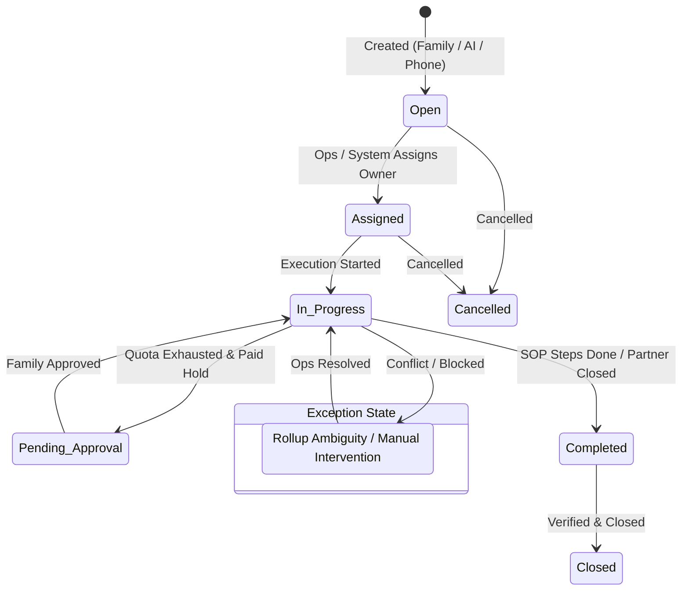
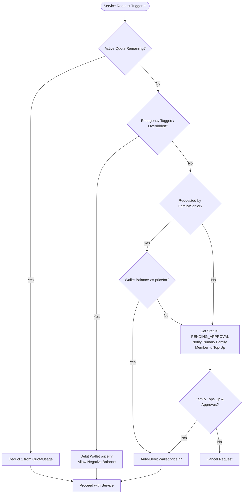

# Architecture Research

**Domain:** Elder Care Operations & Technology Platform (India)  
**Researched:** 2026-08-31  
**Confidence:** HIGH (Authoritative design brief and resolved technical constraints available)

---

## Standard Architecture

### System Overview

The Poco Elder Care platform is organized as a modular monorepo containing a unified NestJS backend, two Next.js web portals, a React Native offline-first mobile app, and shared TypeScript domain packages. The runtime topology is optimized for a single 1GB DigitalOcean droplet hosting Postgres 16, NestJS (with embedded background workers and in-memory caching), and an Nginx reverse proxy.

```
┌─────────────────────────────────────────────────────────────────────────────────────────────────────────┐
│                                           CLIENT SURFACES                                               │
├───────────────────────────────────┬───────────────────────────────────┬─────────────────────────────────┤
│           Family Portal           │            Admin Portal           │            Field App            │
│       (Next.js 14 / Tailwind)     │       (Next.js 14 / Tailwind)     │     (React Native / SQLite)     │
│   • Reassuring wellness dashboard │   • High-density ops queues       │   • Offline-first SOP checklist │
│   • Activity feed & chat          │   • Pending triage & SLA view     │   • Geofenced check-in & GPS    │
│   • Wallet top-up & approvals     │   • Catalog/package versioning    │   • S3 direct media uploads     │
│   • Household switcher (dropdown) │   • Integration health dashboard  │   • Batch offline sync protocol │
└─────────────────┬─────────────────┴─────────────────┬─────────────────┴────────────────┬────────────────┘
                  │                                   │                                  │
                  │ HTTPS (External JWT)              │ HTTPS (Internal Multi-Role JWT)  │ HTTPS (Batch Sync)
                  ▼                                   ▼                                  ▼
┌─────────────────────────────────────────────────────────────────────────────────────────────────────────┐
│                                       NGINX REVERSE PROXY & TLS                                         │
│                      (Static Assets, SSL Termination, API Routing, Gzip Compression)                    │
└──────────────────────────────────────────────────┬──────────────────────────────────────────────────────┘
                                                   │ Proxy Pass (HTTP / Unix Socket)
                                                   ▼
┌─────────────────────────────────────────────────────────────────────────────────────────────────────────┐
│                                     COMMON BACKEND (NestJS Modular API)                                 │
│                                                                                                         │
│  ┌───────────────────────────────┐ ┌───────────────────────────────┐ ┌───────────────────────────────┐  │
│  │   Auth & RBAC Module          │ │  Tickets & SOP State Engine   │ │  Dual SLA & Escalation Engine │  │
│  │   (External & Internal Auth)  │ │  (Decomposition, Rollup, Exc) │ │  (Normal, At Risk, Breached)  │  │
│  └───────────────────────────────┘ └───────────────────────────────┘ └───────────────────────────────┘  │
│  ┌───────────────────────────────┐ ┌───────────────────────────────┐ ┌───────────────────────────────┐  │
│  │   Billing & Wallet Engine     │ │  Activity Feed & AI Module    │ │  Offline Sync & Media Service │  │
│  │   (Quotas, 3-tier Auto-Debit) │ │  (Claude API Classification)  │ │  (S3 Presigned URLs, SQLite)  │  │
│  └───────────────────────────────┘ └───────────────────────────────┘ └───────────────────────────────┘  │
│  ┌───────────────────────────────┐ ┌───────────────────────────────┐ ┌───────────────────────────────┐  │
│  │   12 Partner Stubs Module     │ │  In-Process Queue (pg-boss)   │ │  In-Memory LRU Cache          │  │
│  │   (Pococare, Razorpay, etc.)  │ │  (Workers: 2-4 concurrency)   │ │  (Catalog, Packages, Assign)  │  │
│  └───────────────────────────────┘ └───────────────────────────────┘ └───────────────────────────────┘  │
└──────────────────────────────────┬───────────────────────────────────────────────┬──────────────────────┘
                                   │ Prisma ORM / SQL                              │ S3 API
                                   ▼                                               ▼
┌──────────────────────────────────────────────────────────────────┐ ┌────────────────────────────────────┐
│                        POSTGRESQL 16                             │ │      S3-COMPATIBLE STORAGE         │
│  • Core Relational Schema (Households, Seniors, Tickets, SOPs)   │ │  • Photos, Audio, Video Attachments│
│  • Versioned Catalog & Subscription Grandfathering               │ │  • Direct Client-to-S3 Uploads     │
│  • pg-boss Job Queue Tables (Transactional Enqueue)              │ │  • URLs Stored in Postgres         │
└──────────────────────────────────────────────────────────────────┘ └────────────────────────────────────┘
```

---

### Component Responsibilities

| Component | Responsibility | Typical Implementation |
|-----------|----------------|------------------------|
| **Family Portal** (`apps/family-portal`) | Consumer web interface for adult children/guardians. Offers wellness tracking, real-time ticket visibility, activity feed, wallet top-up, and service approvals. | Next.js 14 (App Router), Tailwind CSS, Shadcn UI, `@poco/design-tokens`, `@poco/ui`, client-side polling. |
| **Admin Portal** (`apps/admin-portal`) | Internal operations command center for ticket triage, dynamic owner reassignment, Care Officer Manager assignment, catalog/package versioning, partner stub health, and Playwright test reporting. | Next.js 14 (App Router), Tailwind CSS, high-density data tables, keyboard shortcuts, role-aware UI gating. |
| **Field App** (`apps/field-app`) | Mobile client for Care Officers. Operates offline-first, displays assigned households, guides wizard-like SOP checklists, captures geofenced visits, and queues batch syncs. | React Native / Expo, WatermelonDB (SQLite), direct S3 presigned URL uploads, background sync worker. |
| **Common Backend** (`apps/api`) | Single authoritative NestJS modular monolith. Enforces all state machines, SLA timers, billing rules, and role-based permissions; serves surface-versioned REST APIs. | NestJS 10, Fastify/Express adapter, Prisma ORM, Passport JWT strategies, Zod validation pipes. |
| **In-Process Job Queue** (`pg-boss`) | Manages asynchronous background processing (webhook ingestion, SLA clock transitions, notification dispatch, AI message classification, recurring billing cycles). | `pg-boss` client integrated in NestJS runtime with low worker concurrency (2–4 jobs) targeting Postgres. |
| **In-Memory Cache** | Minimizes database hits for read-heavy static data on limited server memory. Caches active catalog versions, package definitions, and household-to-officer mappings. | NestJS `CacheModule` with in-memory LRU store (`cache-manager`). Direct cache invalidation on write events. |
| **Shared Packages** (`@poco/*`) | Single-source-of-truth TypeScript libraries across the monorepo, preventing business rule drift between backend and clients. | Monorepo packages: `@poco/types`, `@poco/validation`, `@poco/business-rules`, `@poco/constants`, `@poco/design-tokens`, `@poco/ui`. |
| **12 Partner Integration Stubs** | Realistic in-memory and database-backed stubs simulating external third-party partners (Pococare, Razorpay, ABHA, Exotel, WhatsApp, 1mg, Orange Labs, Health Services, Instamart, Swiggy, Urban Company, Ola). | Dedicated NestJS sub-modules, configurable latency/failure injection, interactive mock UIs for Razorpay & Exotel. |
| **Cloud Storage** | Secure storage for visit media, identity verification documents, and clinical reports without routing heavy binary payloads through the Node.js process. | AWS S3 / Cloudflare R2 with backend-generated presigned PUT/GET URLs. |

---

## Recommended Project Structure

```
pocoeldercare/
├── apps/
│   ├── api/                               # NestJS common backend
│   │   ├── src/
│   │   │   ├── common/                    # Guards, interceptors, filters, decorators
│   │   │   ├── config/                    # Environment validation and configuration
│   │   │   ├── database/                  # Prisma service and repository bindings
│   │   │   ├── modules/
│   │   │   │   ├── auth/                  # Internal & external auth, JWT strategies
│   │   │   │   ├── households/            # Household, senior, ICE profile management
│   │   │   │   ├── assignments/           # Care officer assignments & reporting lines
│   │   │   │   ├── tickets/               # Tickets, decomposition, lifecycle rollup
│   │   │   │   ├── sops/                  # SOP catalog, step completion tracking
│   │   │   │   ├── sla/                   # SLA evaluation & internal escalation engine
│   │   │   │   ├── billing/               # Packages, quotas, 3-tier wallet debit
│   │   │   │   ├── activity-feed/         # Unified feed, AI classification worker
│   │   │   │   ├── visits/                # Field visits, geofencing check-in
│   │   │   │   ├── sync/                  # Offline batch sync & conflict resolution
│   │   │   │   ├── media/                 # S3 presigned URL generation
│   │   │   │   ├── training/              # Certifications & mandatory gating
│   │   │   │   └── integrations/          # 12 partner stubs & webhook handlers
│   │   │   │       ├── pococare/
│   │   │   │       ├── razorpay/
│   │   │   │       ├── exotel/
│   │   │   │       ├── abha/
│   │   │   │       └── stubs/             # Generic loop-closed partner stubs
│   │   │   ├── queue/                     # pg-boss worker definitions & scheduler
│   │   │   └── main.ts                    # NestJS bootstrap entry point
│   │   ├── prisma/
│   │   │   ├── schema.prisma              # Relational schema definition
│   │   │   ├── migrations/                # SQL migration history
│   │   │   └── seed.ts                    # Comprehensive mock seed script
│   │   └── test/                          # Unit and integration test suites
│   ├── family-portal/                     # Next.js 14 Family Web Application
│   │   ├── src/
│   │   │   ├── app/                       # App router pages (dashboard, feed, billing)
│   │   │   ├── components/                # Family-specific UI components
│   │   │   └── hooks/                     # Polling hooks, wallet & ticket mutations
│   │   └── public/
│   ├── admin-portal/                      # Next.js 14 Operations Command Center
│   │   ├── src/
│   │   │   ├── app/                       # Ops queues, catalog, assignments, stubs
│   │   │   ├── components/                # High-density data tables, triage modals
│   │   │   └── hooks/                     # Admin mutations and health monitors
│   │   └── public/
│   └── field-app/                         # React Native (Expo) Mobile App
│       ├── src/
│       │   ├── database/                  # WatermelonDB schemas & models (SQLite)
│       │   ├── screens/                   # SOP wizard, households, visit check-in
│       │   ├── sync/                      # Batch sync engine & offline queue
│       │   └── components/                # Large-touch target mobile components
│       └── assets/
├── packages/
│   ├── types/                             # TypeScript interfaces, enums, API contracts
│   ├── validation/                        # Zod schemas for DTOs and forms
│   ├── business-rules/                    # Canonical state machines, SLA timers, billing
│   ├── constants/                         # System-wide enum values, roles, categories
│   ├── design-tokens/                     # Tailwind color palettes, typography, spacing
│   └── ui/                                # Shared React components (Shadcn wrappers)
├── docker/
│   ├── Dockerfile.api                     # Production multi-stage build for NestJS
│   ├── Dockerfile.web                     # Production build for Next.js portals
│   ├── docker-compose.yml                 # Single-droplet deployment stack
│   └── nginx.conf                         # Reverse proxy configuration
├── docs/                                  # Business brief, specs, architecture records
├── turbo.json                             # Turborepo task pipeline configuration
├── pnpm-workspace.yaml                    # PNPM workspace definition
└── package.json                           # Root package manifest
```

### Structure Rationale

- **`packages/business-rules/` as Canonical Truth:** State machines (Ticket, Service Request, SLA), financial debit decision trees, and permission policies are written once in TypeScript. Both the NestJS backend (authoritative runtime execution) and frontend applications (UI state gating and preview) import from this package, eliminating business logic drift.
- **`apps/api/src/modules/sync/` vs `apps/field-app/src/sync/`:** The offline sync protocol requires symmetrical client-side queuing and server-side validation. Separating the sync domain into dedicated modules ensures clear contract boundaries.
- **Surface-Versioned Endpoints (`/api/family/v1`, `/api/field/v1`, `/api/admin/v1`):** While code resides in one NestJS monolith, breaking the API controllers by surface guarantees client-specific contract stability without bloated payloads.

---

## Architectural Patterns

### Pattern 1: Ticket Decomposition & Rollup Lifecycle

**What:** A customer request or system trigger creates a `Ticket`, which decomposes into one or more `ServiceRequest` items. The parent `Ticket` state is derived deterministically from the aggregate states of its children. Any ambiguous state combination transitions the ticket into `Waiting Ops Update`.  
**When to use:** Every inbound care need (emergency, doctor visit, phlebotomy, pharmacy delivery, errand).  
**Trade-offs:** Adds slight write overhead (evaluating parent state on child update), but prevents orphaned workflows and guarantees complete operations visibility.



**Rollup Evaluation Implementation:**
```typescript
export function computeTicketRollupStatus(childStatuses: ServiceRequestStatus[]): TicketStatus {
  if (childStatuses.length === 0) return TicketStatus.OPEN;
  if (childStatuses.every(s => s === ServiceRequestStatus.CLOSED)) return TicketStatus.CLOSED;
  if (childStatuses.every(s => s === ServiceRequestStatus.COMPLETED || s === ServiceRequestStatus.CLOSED)) {
    return TicketStatus.COMPLETED;
  }
  if (childStatuses.some(s => s === ServiceRequestStatus.WAITING_OPS_UPDATE)) {
    return TicketStatus.WAITING_OPS_UPDATE;
  }
  if (childStatuses.some(s => s === ServiceRequestStatus.PENDING_APPROVAL)) {
    return TicketStatus.PENDING_APPROVAL;
  }
  if (childStatuses.some(s => s === ServiceRequestStatus.IN_PROGRESS)) {
    return TicketStatus.IN_PROGRESS;
  }
  if (childStatuses.some(s => s === ServiceRequestStatus.ASSIGNED)) {
    return TicketStatus.ASSIGNED;
  }
  if (childStatuses.every(s => s === ServiceRequestStatus.CANCELLED)) {
    return TicketStatus.CANCELLED;
  }
  return TicketStatus.WAITING_OPS_UPDATE; // Fallback exception state
}
```

---

### Pattern 2: Orthogonal Dual SLA State Machine & Fallback Escalation

**What:** Response and delivery SLAs are tracked independently of the operational lifecycle. A dedicated SLA engine evaluates timers and maintains an orthogonal status (`NORMAL` → `AT_RISK` → `BREACHED`). A transition to `BREACHED` automatically fires internal escalation (Care Officer → Senior Care Officer fallback).  
**When to use:** All active `ServiceRequest` records until reaching terminal status (`COMPLETED`, `CLOSED`, `CANCELLED`).  
**Trade-offs:** Requires scheduled evaluation jobs, but isolates time-based compliance from workflow steps.

```
                    ┌───────────────────────────────┐
                    │            NORMAL             │
                    │   (Elapsed < 75% SLA Limit)   │
                    └───────────────┬───────────────┘
                                    │
                                    │ SLA Clock >= 75%
                                    ▼
                    ┌───────────────────────────────┐
                    │            AT RISK            │
                    │  (Elapsed >= 75% & < 100%)    │
                    │  *Surfaces on Ops Dashboard*  │
                    └───────────────┬───────────────┘
                                    │
                                    │ SLA Clock >= 100%
                                    ▼
                    ┌───────────────────────────────┐
                    │           BREACHED            │
                    │   *Fires Internal Fallback*   │
                    │   Care Officer ──> Senior CO  │
                    └───────────────────────────────┘
```

---

### Pattern 3: 3-Tier Billing & Grandfathered Quota Engine

**What:** When a service request is fulfilled, billing follows a strict 3-tier hierarchy:
1. **Tier 1 (Quota):** Deduct from active package quota if units remain in the current billing cycle.
2. **Tier 2 (Emergency Override):** If tagged emergency, deliver immediately and debit the household wallet by `priceInr`, allowing a negative balance.
3. **Tier 3 (User-Requested Auto-Debit vs. Approval Hold):** If explicitly requested by family/senior and wallet balance is sufficient, auto-debit `priceInr`. Otherwise, halt service in `PENDING_APPROVAL` and notify the primary payer.



---

### Pattern 4: Offline-First Sync with Client UUIDs & Server Authority

**What:** The Field App writes all local mutations (visit logs, SOP steps, checklist responses) to an on-device SQLite database (WatermelonDB) using client-generated v4 UUIDs. During network reconnect, records are synced via a batch endpoint.  
**When to use:** All Field App operations.  
**Trade-offs:** Field App must maintain a local schema and synchronization queues, but field officers can work seamlessly in basements, rural areas, and low-connectivity homes.

```
┌─────────────────────────┐                            ┌─────────────────────────┐
│     Field App (Local)   │                            │   NestJS Common Backend │
└────────────┬────────────┘                            └────────────┬────────────┘
             │                                                      │
             │ 1. Capture SOP Step / Visit Check-in                 │
             │    Generate Client UUID (synced = false)             │
             │                                                      │
             │ 2. POST /api/field/v1/sync/batch                     │
             │    Payload: [{ id: uuid, entity, changes, ts }]      │
             ├─────────────────────────────────────────────────────►│
             │                                                      │ 3. Validate Idempotency & Auth
             │                                                      │ 4. Transactional DB Write
             │                                                      │    (Server overrides conflicts)
             │ 5. Response: { syncedIds: [uuid], conflicts: [] }    │
             │◄─────────────────────────────────────────────────────┤
             │                                                      │
             │ 6. Mark Local Records synced = true                  │
             ▼                                                      ▼
```

---

### Pattern 5: Decoupled Asynchronous AI Activity Feed Classification

**What:** When a free-form message is sent to a household activity feed, it is immediately written to the timeline. An asynchronous background job (`ai-classification`) passes the message and recent context to the Claude API. If a care service need is detected with confidence $\ge \text{threshold}$, a ticket in `PENDING_TRIAGE` is auto-created for Operations confirmation.  
**When to use:** Real-time chat messages between family members and care officers.  
**Trade-offs:** The UI never blocks on external LLM latency; Ops retains human-in-the-loop control over ticket dispatch.

```
[Family / Care Officer] ───► POST /feed/messages ───► [Database Insert] ───► Response (201 Created)
                                                             │
                                                             ▼ (Transactional Enqueue)
                                                  [pg-boss: ai-classification]
                                                             │
                                                             ▼ (In-Process Worker)
                                                  [Claude Structured API Call]
                                                             │
                                   ┌─────────────────────────┴─────────────────────────┐
                                   │ Confidence >= Threshold                           │ Confidence < Threshold
                                   ▼                                                   ▼
                    [Auto-Create Ticket]                                        [Log Model Output]
                    [Status: PENDING_TRIAGE]                                    [No Ticket Created]
                    [Tag Feed Item with Status Chip]
                                   │
                                   ▼
                    [Operations Triage Queue (Admin Portal)]
                                   │
                    ┌──────────────┴──────────────┐
                    ▼                             ▼
        [Confirm & Decompose]            [Dismiss False Positive]
```

---

### Pattern 6: Direct-to-S3 Presigned URL Media Storage

**What:** Binary payloads (photos, audio recordings, medical docs) are never uploaded to the NestJS API server. Clients request an S3 presigned PUT URL from the backend, upload the file directly to object storage, and then submit the resulting URL in the metadata payload.  
**When to use:** SOP step verification photos, identity documents, and senior vitals records.  
**Trade-offs:** Requires a two-step client upload flow, but completely protects the 1GB server from memory spikes and network saturation.

---

## Data Flow

### Request Flow

```
[Client Request: Family / Field / Admin]
    │
    ▼ HTTPS
[Nginx Reverse Proxy (SSL Termination & Gzip)]
    │
    ▼ HTTP (Internal)
[NestJS Global Pipeline]
    ├── Helmet & CORS Middleware
    ├── Auth Guard (Validate External / Internal JWT)
    ├── Roles & Household Scope Guard (Validate Permissions)
    └── Zod Validation Pipe (Validate Request DTO)
    │
    ▼
[Controller Layer]
    │
    ▼
[Service Domain Layer (@poco/business-rules)]
    ├── In-Memory LRU Cache Check (Read Path)
    └── Prisma Transaction (Write Path)
        ├── PostgreSQL 16 (Relational Update)
        └── pg-boss (Enqueue Asynchronous Background Job)
    │
    ▼
[Response Formatter (Standard JSON Envelope)] ───► [Client Response]
```

### State Management

```
┌────────────────────────────────────────────────────────────────────────┐
│                        SERVER STATE (PostgreSQL 16)                    │
│   • Source of Truth: Tickets, Service Requests, SLA, Quota, Wallets    │
└───────────────────────────────────┬────────────────────────────────────┘
                                    │
       ┌────────────────────────────┼────────────────────────────┐
       │ HTTP Polling (5s-15s)      │ Batch Pull / Push Sync     │ SWR / React Query
       ▼                            ▼                            ▼
┌───────────────┐           ┌───────────────┐           ┌───────────────┐
│ Family Portal │           │   Field App   │           │ Admin Portal  │
│ (React State) │           │(WatermelonDB) │           │ (React Query) │
└───────────────┘           └───────────────┘           └───────────────┘
```

---

### Key Data Flows

#### 1. Ticket Decomposition & Rollup Lifecycle
1. **Creation:** Family submits a ticket via Family Portal, IVR initiates an Exotel phone-in ticket, or a wearable webhook triggers an alert.
2. **Triage & Decomposition:** Operations Executive opens the ticket in Admin Portal and spawns child `ServiceRequest` records (e.g., Ticket = "Hospitalization" → Service 1 = "Ambulance Dispatch", Service 2 = "Admission Paperwork").
3. **Execution:** Service requests are claimed by or assigned to dynamic owners (Care Officer, Partner Stub, Ops).
4. **Step Execution:** Care Officer completes SOP steps via Field App.
5. **Rollup Evaluation:** Upon each child status change, the backend recalculates `Ticket.status`. If all children reach `COMPLETED`, the ticket marks `COMPLETED`. If an invalid permutation occurs, the ticket marks `WAITING_OPS_UPDATE`.

#### 2. SOP Execution & S3 Presigned Media Capture
1. Field Officer opens an assigned `ServiceRequest` on the Field App.
2. The app renders a step-by-step wizard. If step $N$ requires a photo:
   - App requests a presigned URL via `POST /api/field/v1/media/presigned-url`.
   - Backend returns `{ uploadUrl, fileKey, publicUrl }`.
   - App uploads image binary directly to S3 storage.
3. App records step completion locally in SQLite with S3 URL and client UUID.
4. App pushes completion to backend via `/api/field/v1/sync/batch`.

#### 3. Dual SLA Monitoring & Internal Escalation
1. When a `ServiceRequest` is created, its catalog version defines `responseSlaMinutes` and `deliverySlaMinutes`.
2. Backend creates an `SLAState` record with target timestamps (`responseDueAt`, `deliveryDueAt`).
3. An in-process `pg-boss` recurring worker evaluates open service requests every 60 seconds:
   - If $\text{elapsed} \ge 75\%$ of SLA duration $\rightarrow$ State transitions to `AT_RISK`.
   - If $\text{elapsed} \ge 100\%$ of SLA duration $\rightarrow$ State transitions to `BREACHED`.
4. On transition to `BREACHED`:
   - System triggers internal escalation: lookup household Care Officer $\rightarrow$ lookup Senior Care Officer via `ReportingLine`.
   - Fallback notification sent to Senior Care Officer; ticket highlighted in Ops Escalation Queue.

#### 4. 3-Tier Billing, Quotas & Wallet Debit
1. Service completion triggers the Billing Engine.
2. Engine checks household's pinned `PackageVersion` and active `QuotaUsage` for the current billing cycle:
   - **Case A (In-Quota):** If quota remaining $> 0$, decrement quota, log `WalletTransaction(type=QUOTA_COVERED, amount=0)`.
   - **Case B (Out-of-Quota Emergency):** If quota exhausted but tagged Emergency (or overridden by Ops), debit wallet by `priceInr` (allowing negative balance), log `WalletTransaction(type=AUTO_DEBIT_EMERGENCY)`.
   - **Case C (Out-of-Quota Requested):** If requested by family and `Wallet.balance >= priceInr`, auto-debit and log `WalletTransaction(type=AUTO_DEBIT_REQUESTED)`.
   - **Case D (Out-of-Quota Unfunded/Unapproved):** Place `ServiceRequest` in `PENDING_APPROVAL`, trigger family notification ladder.

#### 5. AI Activity Feed Message Classification & Ops Triage
1. Family member posts a message: *"Can someone visit mother tomorrow for blood sugar check?"*
2. Message saved to `ActivityFeedItem` and displayed immediately in the feed.
3. Backend enqueues `ai-classification` job in `pg-boss`.
4. Worker calls Claude API with structured schema:
   - Output: `{ isServiceRequest: true, suggestedService: "home_phlebotomy", confidence: 0.92 }`.
5. Confidence exceeds threshold (0.80):
   - Ticket auto-created in `PENDING_TRIAGE` linked to the feed item.
   - Activity feed item displays a "Pending Triage" chip.
6. Ops Executive reviews in Admin Portal:
   - **Approve:** Decomposes into "Home Phlebotomy" service request.
   - **Reject:** Dismisses false positive; feed chip removed.

#### 6. Field App Offline-First Sync & Conflict Resolution
1. Officer operates Field App offline; performs 3 visits and completes 2 SOPs.
2. Local WatermelonDB creates records with `synced = false` and unique client UUIDs.
3. Upon detecting internet connection, app sends `POST /api/field/v1/sync/batch` with all un-synced entities.
4. Backend runs Prisma transaction:
   - For simple fields (notes, vitals): Last-write-wins by timestamp.
   - For state transitions & financial actions: Server evaluates validity. If state was already closed on server, backend rejects transition and flags conflict in sync response.
5. Field App marks accepted records as `synced = true` and renders conflict banner for any rejected items.

---

## Scaling Considerations

### Resource Budget for 1GB DigitalOcean Droplet

| Component | Target Memory Allocation | Optimization Techniques |
|-----------|--------------------------|-------------------------|
| **PostgreSQL 16** | 250 MB | `shared_buffers = 128MB`, `work_mem = 4MB`, `max_connections = 40`, vacuum tuning. |
| **NestJS Backend + Workers** | 350 MB | In-process `pg-boss` (concurrency 2–4), in-memory LRU cache (capped at 50MB), `--max-old-space-size=350`. |
| **Nginx Reverse Proxy** | 50 MB | Static asset caching, lightweight worker processes, keepalive timeouts. |
| **Operating System & Buffers**| 350 MB | Swap file enabled (1GB-2GB zram/swapfile), low OS daemon overhead. |
| **Total Allocation** | **1000 MB** | Strict ceiling maintained without multi-container process sprawl. |

---

### Scaling Priorities & Roadmap

| Scale Tier | Architecture Adjustments | Bottlenecks & Remedies |
|------------|--------------------------|------------------------|
| **0 – 500 Households (MVP Stage)** | Single 1GB DO Droplet. Docker Compose with Postgres, NestJS (API + in-process workers), Nginx. In-memory LRU cache. | **RAM Contention:** Keep worker concurrency low (2–4); avoid in-memory file buffers; offload media to S3 directly. |
| **500 – 5,000 Households** | Upsize Droplet to 4GB/8GB RAM (or Managed Postgres). Split Next.js static builds to Vercel/Cloudflare Pages. | **Database Connections & CPU:** Move Postgres to DigitalOcean Managed DB; enable connection pooling (PgBouncer). |
| **5,000 – 50,000+ Households** | Multi-container cluster. Standalone Redis cluster for distributed caching & BullMQ. Dedicated worker nodes. | **State Machine Contention:** Separate background job workers from HTTP API instances; introduce Redis pub/sub. |

---

## Anti-Patterns

### Anti-Pattern 1: Running Standalone Redis & Multi-Container Workers on 1GB RAM
**What people do:** Spinning up separate Redis, RabbitMQ, and dedicated background worker containers on an entry-level droplet.  
**Why it's wrong:** Linux OOM (Out Of Memory) killer will terminate Postgres or Node runtime under moderate load.  
**Do this instead:** Use Postgres-backed `pg-boss` running in-process inside NestJS, and in-memory LRU caching.

### Anti-Pattern 2: Duplicating State Machine & Billing Rules in Client Apps
**What people do:** Implementing ticket transition rules and wallet debit calculations inside Next.js and React Native frontends.  
**Why it's wrong:** Logic drifts between surfaces; offline clients might commit illegal financial or state operations.  
**Do this instead:** Define rules once in `@poco/business-rules`. Frontends only import rules to conditionally render UI controls; the NestJS backend is the sole runtime authority.

### Anti-Pattern 3: Streaming Binary File Uploads Through the Backend API
**What people do:** Posting multipart/form-data image binaries from the mobile app to NestJS, which buffers and forwards to S3.  
**Why it's wrong:** 5 Care Officers uploading visit photos simultaneously will saturate server bandwidth and cause Node process heap spikes.  
**Do this instead:** Use presigned S3 PUT URLs generated by the backend; mobile app uploads directly to S3.

### Anti-Pattern 4: Cross-Household Shared Wallets & Global Views
**What people do:** Aggregating wallets or feeds across multiple households for a single user account.  
**Why it's wrong:** Breaks the strict per-household financial isolation and subscription accounting model.  
**Do this instead:** Scope all wallet balances, subscriptions, and activity feeds strictly to `householdId`. Multi-household users must explicitly toggle context via the household switcher dropdown.

### Anti-Pattern 5: Blocking Chat Message Postings on External LLM APIs
**What people do:** Calling Claude or OpenAI synchronously in the `POST /feed/messages` request handler.  
**Why it's wrong:** Third-party LLM latency (2–5 seconds) or outages will stall the user-facing chat experience.  
**Do this instead:** Persist chat messages instantly to Postgres; enqueue an asynchronous `ai-classification` job in `pg-boss`.

### Anti-Pattern 6: Allowing Multi-Role or SCO Overrides on Household Assignments
**What people do:** Permitting Senior Care Officers or Admins to reassign Care Officers to households.  
**Why it's wrong:** Violates the governance invariant that only the **Care Officer Manager** role can assign officers after verifying mandatory certifications.  
**Do this instead:** Enforce role-based guards at the service layer allowing only `Care Officer Manager` to invoke assignment mutations.

---

## Integration Points

### External Services (12 Integration Partner Stubs)

| Partner | Integration Pattern | Direction | Stub Implementation & Notes |
|---------|---------------------|-----------|-----------------------------|
| **Pococare** | REST + Webhook | Bi-directional | Emergency helpline, 24x7 ambulance dispatch, ICE profile sync, teleconsult. Stub returns immediate dispatch acknowledgement and sends delayed webhook (`POST /webhooks/v1/pococare/ambulance-status`). |
| **Razorpay** | REST + Webhook + Mock UI | Inbound/Outbound | Payment gateway for wallet top-ups. Includes interactive frontend mock modal and webhook handler (`POST /webhooks/v1/razorpay/payment-status`). |
| **ABHA** | REST API | Outbound | Ayushman Bharat Health Account verification and health record vault linking. Stub simulates OTP generation and token validation. |
| **Exotel** | Webhook + Mock UI | Inbound | Telephony IVR. Inbound calls trigger `POST /webhooks/v1/exotel/inbound-call`, auto-creating an ops ticket and popping a mock call UI in Admin Portal. |
| **WhatsApp / SMS** | REST API | Outbound | Outbound notifications for family escalation trees, payment chasing, and visit reminders. Stub logs messages to database for Admin inspection. |
| **1mg** | REST + Webhook | Bi-directional | Prescription fulfillment and medicine home delivery. Stub receives medicine order and sends asynchronous "order delivered" webhook. |
| **Orange Labs** | REST + Webhook | Bi-directional | Home phlebotomy, diagnostic panels, ECG, and X-ray. Stub simulates sample collection scheduling and report attachment callback. |
| **Health Services** | REST + Webhook | Bi-directional | Qualified nursing and home physiotherapy. Stub dispatches partner nurse and posts completion webhook. |
| **Instamart** | REST API | Outbound | Quick commerce grocery ordering oversight. Stub simulates order creation and delivery status polling. |
| **Swiggy** | REST API | Outbound | Meal and senior tiffin coordination. Stub returns simulated tracking URLs. |
| **Urban Company** | REST + Webhook | Bi-directional | Home safety modifications and appliance repair. Stub schedules technician and posts loop-closed webhook. |
| **Ola** | REST API | Outbound | Cab booking and mobility accompaniment. Stub returns driver details and live ride simulation coordinates. |

---

### Internal Boundaries

| Boundary | Communication Mechanism | Notes & Considerations |
|----------|--------------------------|------------------------|
| **Frontends $\leftrightarrow$ Backend** | JSON over HTTPS REST API | Versioned base paths (`/api/family/v1`, `/api/field/v1`, `/api/admin/v1`, `/api/webhooks/v1`). |
| **Field App $\leftrightarrow$ Sync Engine** | Batch Sync Endpoint (`/sync/batch`) | Client-generated UUIDs, idempotent transactions, server-authoritative conflict resolution. |
| **Backend $\leftrightarrow$ Database** | Prisma ORM (TCP / Unix Socket) | Strict connection limits (`connection_limit=20`) to conserve RAM on 1GB droplet. |
| **Backend $\leftrightarrow$ Background Queue** | `pg-boss` (Postgres Polling / LISTEN) | In-process workers; transactional enqueue within standard Prisma business transactions. |
| **Backend $\leftrightarrow$ In-Memory Cache** | In-Process Memory Bus | Invalidated directly on mutation events (e.g., catalog publish, assignment update). |
| **Backend $\leftrightarrow$ AI Service** | HTTPS REST (Anthropic Claude API) | Asynchronous execution via `ai-classification` queue; structured JSON schema outputs. |
| **Client $\leftrightarrow$ Cloud Storage** | HTTPS Direct S3 API | Presigned PUT/GET URLs generated by backend; zero binary streaming through droplet. |

---

## Suggested Build Order & Component Dependency Graph

To ensure systematic implementation without blocked dependencies, components should be constructed in the following order:

```mermaid
flowchart TD
    subgraph Phase1 [Phase 1: Foundation & Shared Packages]
        P1_1[@poco/constants] --> P1_2[@poco/types]
        P1_2 --> P1_3[@poco/validation]
        P1_3 --> P1_4[@poco/business-rules]
        P1_1 --> P1_5[@poco/design-tokens]
        P1_5 --> P1_6[@poco/ui]
    end

    subgraph Phase2 [Phase 2: Database & Core Backend Infrastructure]
        P2_1[Prisma Schema & Migrations] --> P2_2[NestJS Base & Auth Module]
        P2_2 --> P2_3[pg-boss In-Process Queue]
        P2_2 --> P2_4[In-Memory LRU Cache]
        P2_2 --> P2_5[S3 Presigned Media Module]
    end

    subgraph Phase3 [Phase 3: Domain Engines & Partner Stubs]
        P3_1[Ticket & SOP Decomposition Engine]
        P3_2[Dual SLA & Escalation Engine]
        P3_3[Billing, Quotas & Wallet Engine]
        P3_4[Assignments & Mandatory Certs Gate]
        P3_5[Activity Feed & Claude AI Classification]
        P3_6[12 Partner Stubs & Webhook Handlers]
    end

    subgraph Phase4 [Phase 4: API Controllers & Sync Service]
        P4_1[Family Portal API: /api/family/v1]
        P4_2[Field App API & Offline Batch Sync: /api/field/v1]
        P4_3[Admin Portal API: /api/admin/v1]
        P4_4[Inbound Webhooks API: /api/webhooks/v1]
    end

    subgraph Phase5 [Phase 5: Client Surfaces & Mock UIs]
        P5_1[Admin Portal Web App & Ops Queues]
        P5_2[Family Portal Web App & Dashboards]
        P5_3[Field App React Native & WatermelonDB]
        P5_4[Razorpay & Exotel Interactive Mocks]
    end

    subgraph Phase6 [Phase 6: Seeding, Verification & Deployment]
        P6_1[Comprehensive Seed Script]
        P6_2[Vitest Unit & Playwright E2E Suites]
        P6_3[Docker Compose & 1GB Droplet Nginx Deploy]
    end

    Phase1 --> Phase2
    Phase2 --> Phase3
    Phase3 --> Phase4
    Phase4 --> Phase5
    Phase5 --> Phase6
```

### Detailed Build Sequence

1. **Step 1: Monorepo Foundation & Shared Core Packages (`@poco/*`)**
   - Initialize pnpm/turbo monorepo workspace.
   - Build `@poco/constants` (roles, categories, status enums).
   - Build `@poco/types` (entity interfaces, DTO definitions, API envelopes).
   - Build `@poco/validation` (Zod schemas matching DTOs).
   - Build `@poco/business-rules` (Ticket/SOP state machine, SLA calculators, 3-tier billing decision tree).
   - Build `@poco/design-tokens` and `@poco/ui` (Tailwind configuration, Shadcn UI base components).

2. **Step 2: Database Schema & Core Backend Scaffolding**
   - Implement `schema.prisma` covering Identity, Households, Care Officer Assignments, Tickets, Versioned Catalog, SOPs, Versioned Packages, Wallets, Feeds, and Stubs.
   - Run initial migrations and configure Prisma client.
   - Configure NestJS application with dual JWT authentication (external `Person` vs internal `InternalUser` multi-role).
   - Setup in-process `pg-boss` queue module and in-memory `CacheModule`.
   - Setup S3 presigned URL media upload service.

3. **Step 3: Business Logic Engines & Partner Stubs**
   - Implement Ticket & Service Request lifecycle engine with automatic child rollup and `Waiting Ops Update` exception handling.
   - Implement orthogonal Dual SLA engine (`Normal`, `At Risk`, `Breached`) and fallback escalation trigger.
   - Implement 3-tier Billing Engine (Quota deduction, Emergency negative-balance debit, User-requested auto-debit, and Approval hold).
   - Implement Care Officer Assignment service with mandatory certification gating (Care Officer Manager role-gated).
   - Implement Activity Feed with asynchronous Claude AI message classification and human-in-the-loop triage ticket creation.
   - Implement the 12 partner stubs with configurable latency, error simulation, and loop-closed webhooks.

4. **Step 4: Surface-Versioned REST API Layer**
   - Expose Family Portal REST endpoints (`/api/family/v1/...`).
   - Expose Field App REST endpoints (`/api/field/v1/...`) including `/sync/batch` and `/sync/pull`.
   - Expose Admin Portal REST endpoints (`/api/admin/v1/...`) with granular role guards.
   - Expose Inbound Webhooks (`/api/webhooks/v1/...`) with signature verification.

5. **Step 5: Client Application Implementation**
   - **Admin Portal:** High-density Ops Queues (`Pending Triage`, `Waiting Ops Update`, SLA At Risk), Household/Lead Manager, Care Officer Manager, Versioned Catalog/Package Editor, Partner Stub Health Dashboard, and DB Viewer.
   - **Family Portal:** Reassuring wellness dashboard, Activity Feed timeline with status chips, vitals trends, wallet management, service approvals, and multi-household switcher.
   - **Field App:** Offline SQLite local store (WatermelonDB), task/visit list, choice-driven SOP checklists, S3 presigned photo capture, geofenced check-in, and background batch sync.
   - **Interactive Frontend Mocks:** Razorpay checkout modal and Exotel telephony handling popup.

6. **Step 6: Seed Data, Test Automation & Production Deployment**
   - Develop comprehensive seed script ($\ge 2$ users per role, $\sim 50$ care officers, $\sim 200$ households with 1–4 seniors, realistic tickets, SOPs, and wallet transactions).
   - Author Vitest unit tests for `@poco/business-rules` and API services.
   - Author Playwright e2e test suite covering core user journeys (signup $\rightarrow$ assignment $\rightarrow$ visit $\rightarrow$ emergency ticket $\rightarrow$ billing).
   - Build multi-stage Dockerfiles and `docker-compose.yml` with tuned memory limits for single 1GB DigitalOcean Droplet deployment with Nginx.

---

## Sources

- [Poco Elder Care System Design Brief](file:///c:/Users/harib/work/pocoeldercare/docs/poco-elder-care-design-brief.md)
- [Poco Elder Care Project Specification](file:///c:/Users/harib/work/pocoeldercare/.planning/PROJECT.md)
- [NestJS Architecture & Best Practices](https://docs.nestjs.com/)
- [pg-boss PostgreSQL-Backed Job Queue](https://github.com/timgit/pg-boss)
- [WatermelonDB Offline-First Architecture](https://github.com/Nozbe/WatermelonDB)
- [Prisma ORM Data Modeling](https://www.prisma.io/docs)

---
*Architecture research for: Elder Care Operations & Technology Platform (India)*  
*Researched: 2026-08-31*
